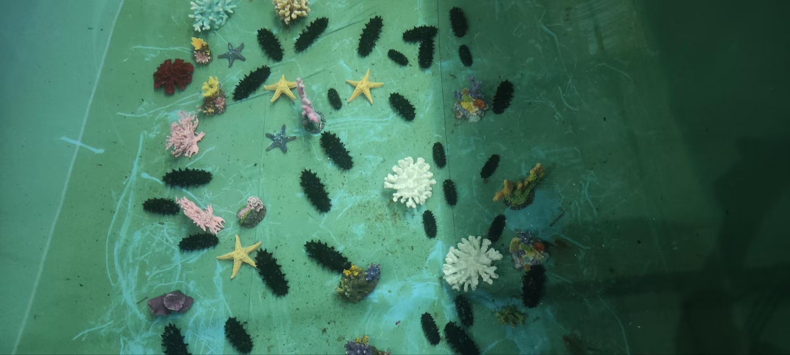
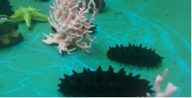
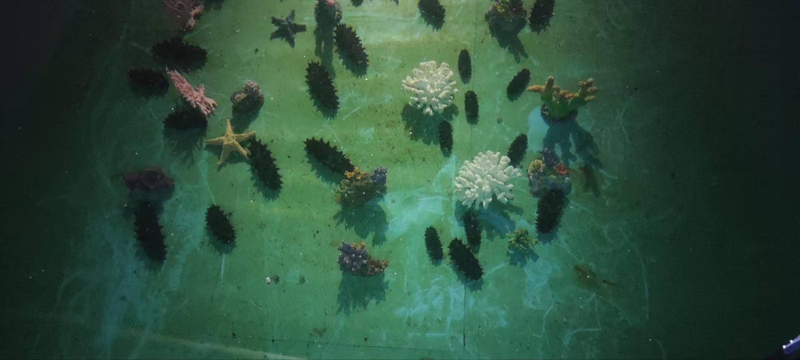
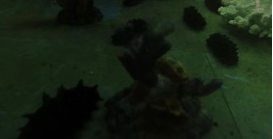
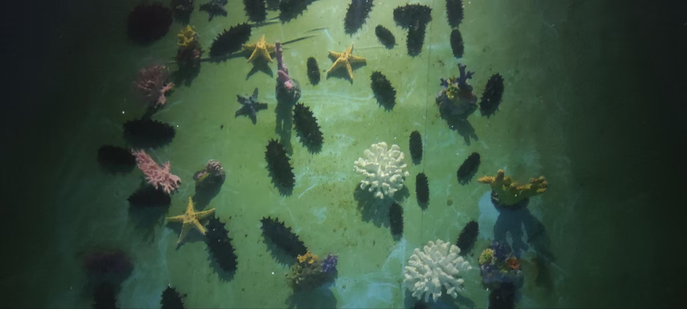
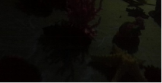

# Underwater Environment Simulation Dataset

This dataset contains 6 sequences simulating underwater environments under different lighting conditions. Each sequence is named in the format: **sequence number_viewpoint_lighting condition_timestamp**. For example: `1_top_light_2024-10-7-02-11-21.bag`.

## Data Collection Equipment:

- **Deep-sea Stereo Camera** (6000-meter encapsulation)


- **Recording Resolution**: 720p
- Recorded Content:
  - Left and right camera images
  - Depth map
  - Raw IMU data
  - Odometry data

## Lighting Conditions:

The dataset simulates three different underwater lighting conditions:

1. **Bright Light**: Simulates an environment with abundant lighting.

     

2. **Medium Light**: Simulates an environment with moderate lighting. 
    

3. **Low Light**: Simulates an environment with low lighting. 

    

The data is divided into two viewpoints:

- **Top View** 
- **Side View** 

### Data Format:

All data is stored in the `rosbag` format, containing the following:

- Image Data:
  - Left camera image (`/lihai/zed_node/left/image_rect_color`)
  - Right camera image (`/lihai/zed_node/right/image_rect_color`)
  - Depth map (`/lihai/zed_node/depth/depth_registered`)
- IMU Data:
  - Raw IMU data (`/lihai/zed_node/imu/data_raw`)
  - Processed IMU data (`/lihai/zed_node/imu/data`)
- Path Data:
  - Trajectory information derived from the camera pose (`/lihai/zed_node/path_odom`)

### Message Types:

- `sensor_msgs/Image`: Image data
- `sensor_msgs/Imu`: IMU data
- `nav_msgs/Path`: Path data

## Camera and IMU Specifications:

- ZED Mini Stereo Camera:
  - Lens distance: 63mm
  - Depth perception range: 0.15m to 12m
  - Field of view: 120° (diagonal)
  - Depth accuracy: Up to 1% (depending on distance and environmental conditions)
  - Built-in IMU (accelerometer and gyroscope)
- **Jetson Xavier NX**: Used for data processing and storage

## Calibration Information:

The calibration files and results are located in the calibration folder.

```
bash复制编辑├── checkerboard.yaml
├── zed_raw
│   ├── Kalib_data_HD720_raw.bag
│   ├── Kalib_data_HD720_raw-camchain.yaml
│   ├── Kalib_data_HD720_raw-report-cam.pdf
│   └── Kalib_data_HD720_raw-results-cam.txt
└── zed_rect
    ├── Kalib_data_HD720.bag
    ├── Kalib_data_HD720-camchain.yaml
    ├── Kalib_data_HD720-report-cam.pdf
    └── Kalib_data_HD720-results-cam.txt
```

## Data Collection Environment:

The data was collected in a simulated underwater environment, located in a pool at the Hunnan workshop with a depth of 1.5 meters and clear water quality. Marine life models such as starfish, coral, and sea cucumbers were used to simulate a real underwater ecosystem. The lighting was simulated under three conditions: strong light, weak light, and low-contrast environments.

## Data Storage Format:

All data is stored in the `rosbag` format, consisting of the following categories:

| Data Category  | Data Content                                                 | Message Type        | Recording Frequency |
| -------------- | ------------------------------------------------------------ | ------------------- | ------------------- |
| **Image Data** | Left camera image (`/lihai/zed_node/left/image_rect_color`)  | `sensor_msgs/Image` | 15 Hz               |
|                | Right camera image (`/lihai/zed_node/right/image_rect_color`) | `sensor_msgs/Image` | 15 Hz               |
|                | Depth map (`/lihai/zed_node/depth/depth_registered`)         | `sensor_msgs/Image` | 15 Hz               |
| **IMU Data**   | Raw IMU data (`/lihai/zed_node/imu/data_raw`)                | `sensor_msgs/Imu`   | 200 Hz              |
|                | Processed IMU data (`/lihai/zed_node/imu/data`)              | `sensor_msgs/Imu`   | 200 Hz              |
| **Path Data**  | Trajectory information derived from the camera pose (`/lihai/zed_node/path_odom`) | `nav_msgs/Path`     | -                   |

## Dataset Details:

The dataset includes 6 sequences, named as: `sequence number_viewpoint_lighting condition_timestamp`. Specifically:

| No.  | Dataset Name                          | Viewpoint | Lighting Condition | Data Processing Difficulty |
| ---- | ------------------------------------- | --------- | ------------------ | -------------------------- |
| 1    | `1_top_light_2024-10-7-02-11-21`      | Top View  | Bright Light       | Easy                       |
| 2    | `2_top_mid_light_2024-10-7-02-23-46`  | Top View  | Medium Light       | Moderate                   |
| 3    | `3_top_low_light_2024-10-7-02-59-08`  | Top View  | Low Light          | Difficult                  |
| 4    | `4_side_low_light_2024-10-7-03-42-57` | Side View | Bright Light       | Easy                       |
| 5    | `5_side_mid_light_2024-10-7-03-58-00` | Side View | Medium Light       | Moderate                   |
| 6    | `6_side_light_2024-10-7-04-08-34`     | Side View | Low Light          | Difficult                  |

## License:

This dataset is open-source and follows the MIT Open Source License. For more details, please refer to the LICENSE file.
