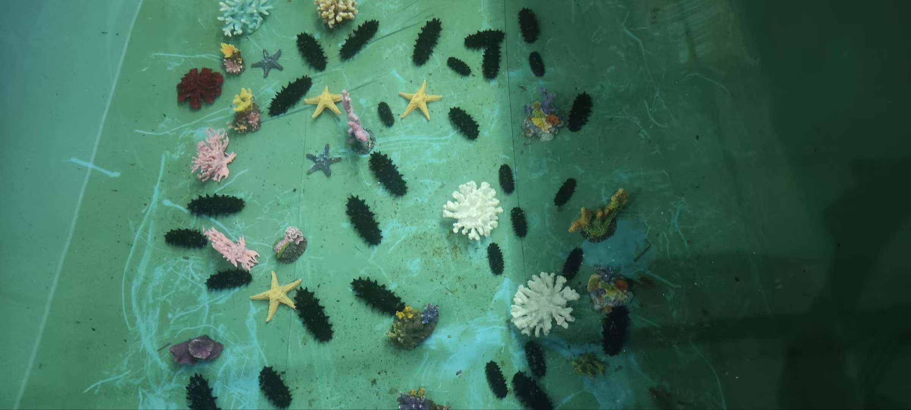

# 水底环境模拟数据集

该数据集包含6个序列，模拟不同光照条件下的水底环境。每个序列的命名格式为：**序列编号_视角_光照条件_时间戳**。例如：`1_top_light_2024-10-7-02-11-21.bag`。

## 数据采集设备：

- **深海双目相机**（6000米封装）


- **录制分辨率**：720p
- 记录内容：

  - 左右相机图像
  - 深度图
  - IMU原始数据
  - 里程计数据

## 光照条件：

数据集模拟了三种不同的水下光照条件：

1. **亮光**：模拟充足光照的环境。
      

2. **中光**：模拟中等光照的环境。
      

3. **暗光**：模拟低光照的环境。
      


数据根据视角分为两种：

- **俯视视角**（Top view）
- **侧视视角**（Side view）

### 数据格式：

所有数据均以`rosbag`格式存储，具体内容包括：

- **图像数据**：
  - 左相机图像（`/lihai/zed_node/left/image_rect_color`）
  - 右相机图像（`/lihai/zed_node/right/image_rect_color`）
  - 深度图（`/lihai/zed_node/depth/depth_registered`）
- **IMU数据**：
  - 原始IMU数据（`/lihai/zed_node/imu/data_raw`）
  - 经过处理的IMU数据（`/lihai/zed_node/imu/data`）
- **路径数据**：
  - 由相机姿态推算的轨迹信息（`/lihai/zed_node/path_odom`）

### 消息类型：

- `sensor_msgs/Image`：图像数据
- `sensor_msgs/Imu`：IMU数据
- `nav_msgs/Path`：路径数据

## 相机与IMU技术规格：

- **ZED Mini 双目相机**：
  - 镜头间距：63mm
  - 深度感知范围：0.15米至12米
  - 视场角：120°（对角线）
  - 深度精度：最高可达1%（受距离和环境条件影响）
  - 内置IMU（加速计与陀螺仪）
- **Jetson Xavier NX**：用于数据处理和存储

## 校准信息：

标定文件和结果位于calibration文件夹中。

```bash
├── checkerboard.yaml
├── zed_raw
│   ├── Kalib_data_HD720_raw.bag
│   ├── Kalib_data_HD720_raw-camchain.yaml
│   ├── Kalib_data_HD720_raw-report-cam.pdf
│   └── Kalib_data_HD720_raw-results-cam.txt
└── zed_rect
    ├── Kalib_data_HD720.bag
    ├── Kalib_data_HD720-camchain.yaml
    ├── Kalib_data_HD720-report-cam.pdf
    └── Kalib_data_HD720-results-cam.txt
```


## 数据采集环境：

数据在一个模拟的水下环境中采集，实验地点位于浑南车间的水池中，水深1.5米，水质清澈。水池内使用了海星、珊瑚、海参等水生物模型，以模拟真实的水下生态环境。光照模拟了三种条件：强光、弱光和低对比度环境。

## 数据存储格式：

所有数据以 `rosbag` 格式存储，包含以下几个数据类别：

| 数据类别     | 数据内容                                              | 消息类型            | 记录频率 |
| ------------ | ----------------------------------------------------- | ------------------- | -------- |
| **图像数据** | 左相机图像（/lihai/zed_node/left/image_rect_color）   | `sensor_msgs/Image` | 15 Hz    |
|              | 右相机图像（/lihai/zed_node/right/image_rect_color）  | `sensor_msgs/Image` | 15 Hz    |
|              | 深度图（/lihai/zed_node/depth/depth_registered）      | `sensor_msgs/Image` | 15 Hz    |
| **IMU数据**  | 原始IMU数据（/lihai/zed_node/imu/data_raw）           | `sensor_msgs/Imu`   | 200 Hz   |
|              | 处理后的IMU数据（/lihai/zed_node/imu/data）           | `sensor_msgs/Imu`   | 200 Hz   |
| **路径数据** | 由相机姿态推算的轨迹信息（/lihai/zed_node/path_odom） | `nav_msgs/Path`     | -        |

## 数据集详情：

该数据集包含6个序列，命名规则为：`序列编号_视角_光照条件_时间戳`。具体如下：

| 序号 | 数据集名称                            | 视角     | 光照情况 | 数据处理难度 |
| ---- | ------------------------------------- | -------- | -------- | ------------ |
| 1    | `1_top_light_2024-10-7-02-11-21`      | 俯视视角 | 亮光     | 简单         |
| 2    | `2_top_mid_light_2024-10-7-02-23-46`  | 俯视视角 | 中光     | 中等         |
| 3    | `3_top_low_light_2024-10-7-02-59-08`  | 俯视视角 | 暗光     | 困难         |
| 4    | `4_side_low_light_2024-10-7-03-42-57` | 侧视视角 | 亮光     | 简单         |
| 5    | `5_side_mid_light_2024-10-7-03-58-00` | 侧视视角 | 中光     | 中等         |
| 6    | `6_side_light_2024-10-7-04-08-34`     | 侧视视角 | 暗光     | 困难         |

## 许可证：

该数据集已开源，遵循 MIT开源协议，具体请查看 LICENSE 文件。
